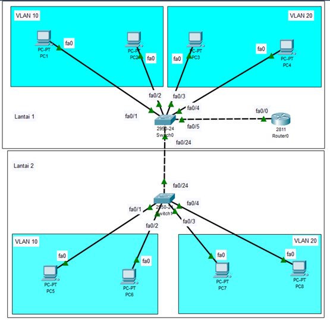
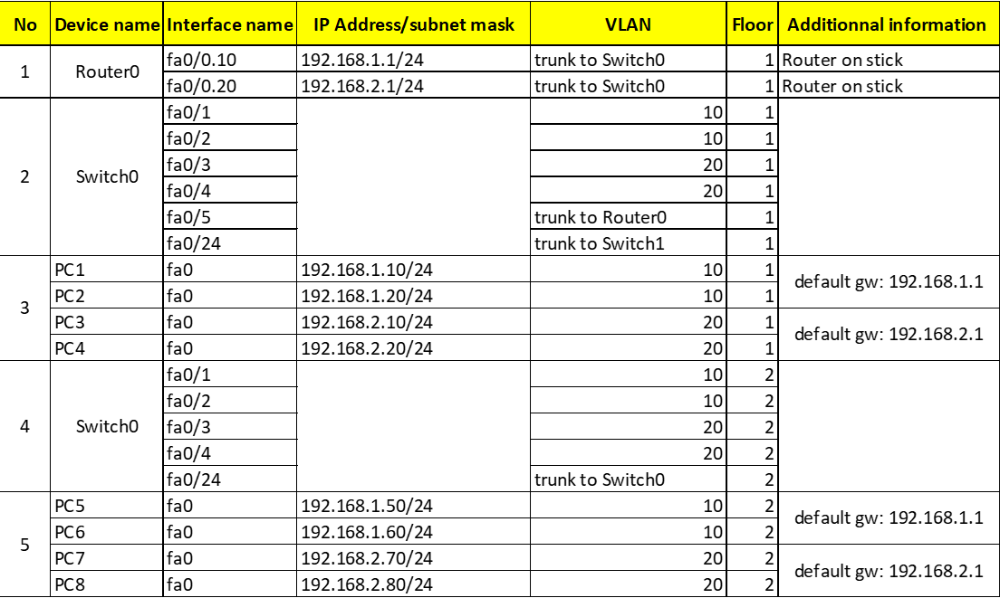
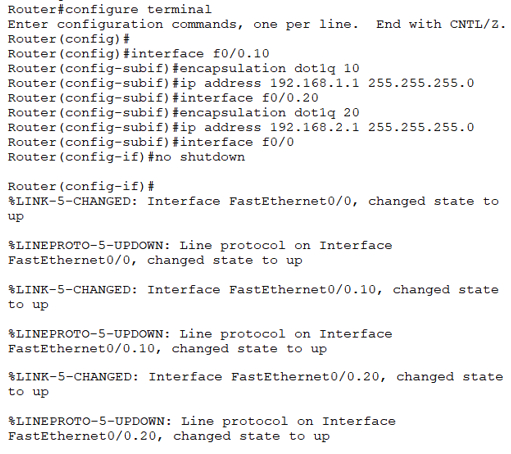
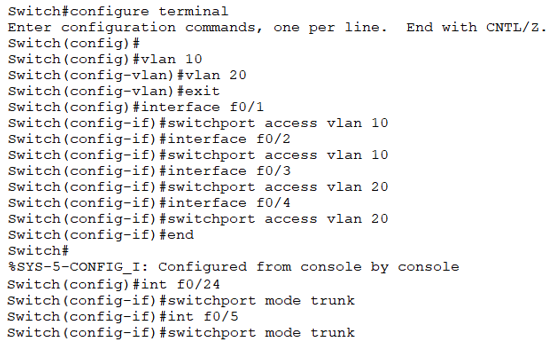
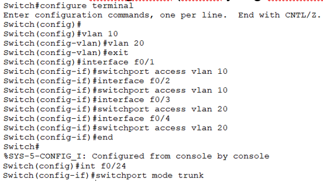
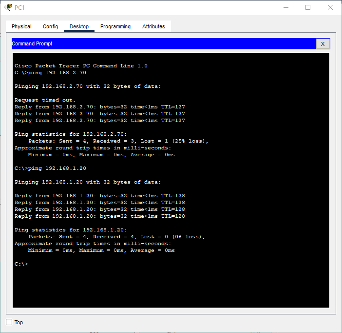

# Laporan Praktikum Konsep Jaringan

### Nama : Muhammad Faishal Nabhan

### NRP : 3121600021

### Kelas : 2 D4 Teknik Informatika A

# POSTES UTS

## Praktikum

Berikut merupakan topologi yang digunakan dalam praktikum kali ini.

Konfigurasi IP yang akan digunakan adalah sebagai berikut :

## Analisa

### Konfigurasi pada router0 :

Penjelasan :
Pada log CLI tersebut, dapat diamati bahwa terjadi sebuah konfigurasi terhadap Router. Runtutan command tersebut digunakan untuk melakukan konfigurasi router-on-a-stick inter VLAN routing.
Pada port fa0/0 sub 10 diberikan command encapsulation dengan standart dot1q serta IP Address 192.168.1.1 dan pada port fa0/0 sub 20 diberikan encapsulation dengan standart dot1q dan IP address 192.168.2.1

### Konfigurasi pada switch0 :

Penjelasan:
Log CLI tersebut merupakan runtutan command yang digunakan untuk melakukan konfigurasi terhadap Switch0. Tiap interface dikonfigurasi sesuai VLAN yang sudah diperintahkan di atas serta untuk interface f0/5 dan f0/24 dikonfigurasi menjadi mode trunk.

### Konfigurasi pada switch1 :

Penjelasan :
Log CLI tersebut merupakan runtutan command yang digunakan untuk melakukan konfigurasi terhadap Switch1. Tiap interface dikonfigurasi sesuai VLAN yang sudah diperintahkan di atas serta untuk interface f0/24 dikonfigurasi menjadi mode trunk.

## Hasil Konfigurasi

Setelah setiap perangkat dikonfigurasi, maka akan didapatkan hasil seperti berikut :

