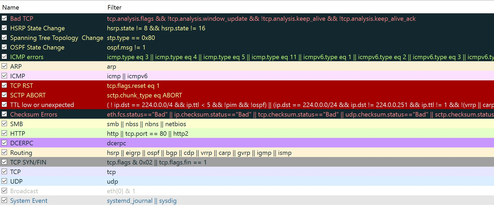

# LAPORAN PRAKTIKUM KONSEP JARINGAN
# WIRESHARK
##  Muhammad Faishal Nabhan - NRP 3121600021 - 2 D4 IT-A 

#### Wireshark

**Wireshark** adalah aplikasi penganalisa paket yang gratis dan bersifat open-source. Umumnya digunakan untuk melakukan troubleshooting jaringan, analisis, pengembangan software dan protokol komunikasi, serta edukasi. Awalnya bernama Ethereal, proyek ini berganti nama menjadi Wireshark pada Mei 2006 karena masalah merek dagang.

Wireshark bersifat cross-platform, menggunakan Qt widget toolkit dalam perilisannya untuk mengimplementasikan interface penggunanya, serta menggunakan pcap untuk meng-capture paket. Dapat beroperasi di Linux, macOS, BSD, Solaris, serta beberapa sistem operasi Unix, dan juga Microsoft Windows. Adapun juga versi berbasis terminal (non-GUI) yang disebut TShark. Wireshark, dan program lain yang terdistribusi dengan program tersebut seperti TShark, adalah software gratis, dirilis dibawah persyaratan dari GNU General Public License versi ke-2 atau versi setelahnya.

#### Coloring Rules dalam Wireshark

Wireshark membantu penggunanya untuk mengidentifikasi tipe paket dengan memberikan pembedaan warna tiap tipe paketnya.

| Warna dalam Wireshark | Tipe Paket |
| --------------------  | ---------- |
|       Ungu muda       |    TCP     |
|       Biru muda       |    UDP     |
|        Hitam          |Paket dengan error|
|       Hijau muda      | HTTP Traffic |
|      Kuning muda      | Blocks (SMB) dan NetBIOS |
|       Kuning gelap    |  Routing     |
|     Abu-abu gelap      | TCP SYN, FIN dan ACK Traffic |

Warna dalam Wireshark :

#### Mengecek Alamat IP, Default Gateway, dan Melakukan Ping 

#### Packet Analyzer

#### Frame

Dalam lapisan frame terdapat :
- Arrival time : ---- menunjukkan waktu saat pengiriman data.
- [Time delta from previous], [Time delta from previous], [Time since] menunjukkan waktu sebelum capture dari frame, waktu setelah frame ditampilkan, dan juga waktu sejak awal frame.
- Frame number : --- menunjukkan nomor dari frame tersebut.
- Frame length : --- menunjukkan panjangnya frame dalam bentuk byte.
- [Protocols in frame: eth:] menunjukkan protokol apa saja yang ada dalam satu frame.
- ::: Pada lapisan frame ini memiliki beberapa lapisan protokol seperti Ethernet, IP, TCP, HTTP, dan data.

#### Ethernet II

- Source : --- ini menunjukkan MAC dari source dan MAC dari destination
- ::: Lapisan ini merupakan lapisan data link MAC dari source dan destination

#### Internet Protocol v4

Dalam lapisan Internet Protocol v4 terdapat :
- 0100 .... = Version 4
- .... 0101 = Header Length : 20 bytes(5) menunjukkan panjang header
- Internet Source Address : ---- menunjukkan IP Source, Destination Address : --- menunjukkan IP Destination
- ::: Lapisan ini merupakan lapisan network yang memiliki panjang 20 bytes dan memiliki IP Source serta IP Destination

#### ICMP (Internet Control Message Protocol)

Dalam lapisan ICMP terdapat :

- terdapat type, code, checksum, Identifier(BE/LE), Sequence Number(BE/LE) seperti pada gambar
- [Request frame]. dari data ICMP tersebut saat echo ping request yang mana ICMP memiliki type, code, dengan algoritma checksum dll. menunjukkan hasil saat request ping yang berasal dari paket dari source IP Address dari komputer yang melakukan request ping ke destination.
