# LAPORAN PRAKTIKUM KONSEP JARINGAN
# Cisco Packet Tracer

## Dasar Teori

### Packet Tracer

**Packet Tracer** adalah simulator alat-alat jaringan Cisco yang sering digunakan sebagai media pembelajaran dan pelatihan, dan juga dalam bidang penelitian simulasi jaringan komputer. Program ini dibuat oleh Cisco Systems dan disediakan gratis untuk fakultas, siswa dan alumni yang telah berpartisipasi di Cisco Networking Academy. Tujuan utama Packet Tracer adalah untuk menyediakan alat bagi siswa dan pengajar agar dapat memahami prinsip jaringan komputer dan juga membangun skill di bidang alat-alat jaringan Cisco.

Selain untuk mensimulasikan aspek-aspek tertentu dari komputer jaringan, Packet Tracer juga dapat digunakan untuk kolaborasi. Mulai Packet Tracer 5.0, Packet Tracer mendukung multi-user sistem yang memungkinkan beberapa pengguna untuk menghubungkan beberapa topologi bersama-sama melalui jaringan komputer. Packet Tracer juga memungkinkan instruktur untuk membuat kegiatan-kegiatan yang siswa harus selesaikan. Packet Tracer ini sering digunakan dalam pengaturan pendidikan sebagai alat bantu pembelajaran. Cisco Systems menyatakan bahwa Packet Tracer ini berguna untuk jaringan eksperimen.

### ARP

**ARP** (**Address Resolution Protocol**) merupakan sebuah protokol jaringan yang digunakan untuk mengetahui alamat hardware. Protokol ini digunakan untuk mengetahui MAC Adress dari suatu perangkat.

ARP digunakan jika seseorang ingin melakukan komunikasi dengan beberapa perangkat lainnya pada jaringan lokal. Misalnya, jaringan ethernet yang memang memerlukan alamat sebelum melakukan komunikasi atau melakukan pengiriman paket jaringan. Sebuah perangkat yang bertugas sebagai pengirim yang menggunakan ARP akan menerjemahkan IP Address ke MAC Address.

ARP mempunyai peran yang sangat penting di dalam jaringan. Terutama jika berkaitan dengan komunikasi data yang ada di dalam jaringan tersebut. Setiap host yang terhubung ke dalam jaringan LAN bisa saling berkomunikasi dengan menggunakan physical adress atau MAC Address dan tidak menggunakan logical address atau IP Address. Setiap host dapat berkomunikasi menggunakan MAC Address. Dengan kata lain, setiap host yang ingin berkomunikasi dengan host lainnya harus memiliki physical address atau MAC Address dari host tujuannya tersebut.

Untuk mendapatkan MAC address, hal pertama yang harus dilakukan adalah ketika transfer data, data tersebut sebelumnya harus diberi IP Address. IP Address yang ditambahkan tersebut merupakan alamat IP yang dimiliki oleh host pengirim dan penerima. Setelah itu baru bisa menentukan MAC Address dari host tujuan. Disinilah peran penting ARP. Dengan memanfaatkan alamat IP host tujuan, host pengirim dapat melakukan pencarian dengan menggunakan protokol ARP

Cara kerja dari ARP adalah awalnya ARP akan melakukan pengiriman berupa pesan yang sifatnya menyeluruh atau broadcast. Isi dari pesan yang dikirimkan tersebut berupa permintaan seputar MAC Address dari suatu host dengan berdasarkan pada alamat IP yang dimiliki oleh setiap host. Pesan tersebut dikirim secara menyeluruh ke semua host yang tersambung di dalam jaringan
lalu setelah pesan yang dikirimkan ARP sampai ke host tujuan, maka host tersebut akan membalas pesan yang berisi physical address atau MAC Address yang disesuaikan dengan alamat IP yang diminta.

## PRAKTIKUM

Pada laporan kali ini, akan diamati bagaimana sebuah jaringan berjalan pada suatu PC. Dalam laporan ini terdapat 3 skenario, yaitu : PC1 melakukan ping ke PC2 (awal); PC1 melakukan ping ke PC2, dan; PC2 melakukan ping ke PC1.

Langkah pertama yang dilakukan adalah melakukan setup PC terlebih dahulu pada skema jaringan dalam Packet Tracer, kemudian set IP pada setiap PC

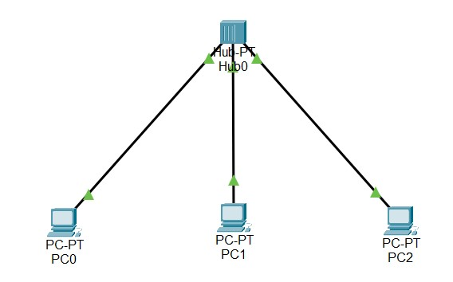

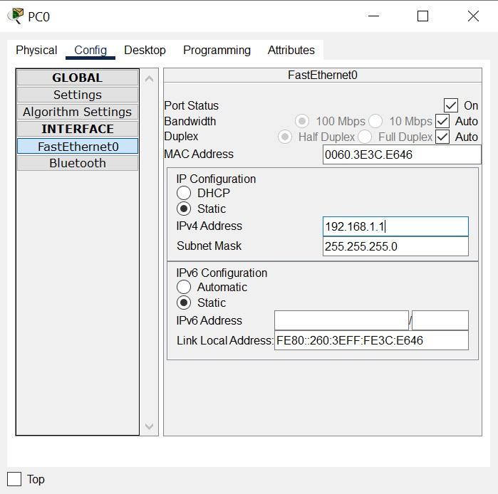

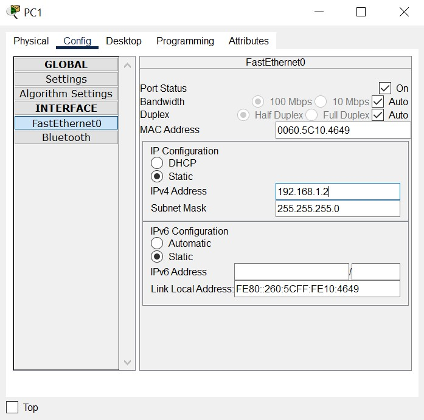

Setelah IP pada setiap PC sudah di-set maka selanjutnya masuk ke skenario yang dibahas sebelumnya.

## Skenario 1, PC0 ke PC1 (awal)

- Pertama check ARP lalu ping PC1 pada Command Prompt PC0

 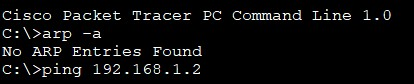

- Setelah melakukan ping maka akan muncul pesan :

  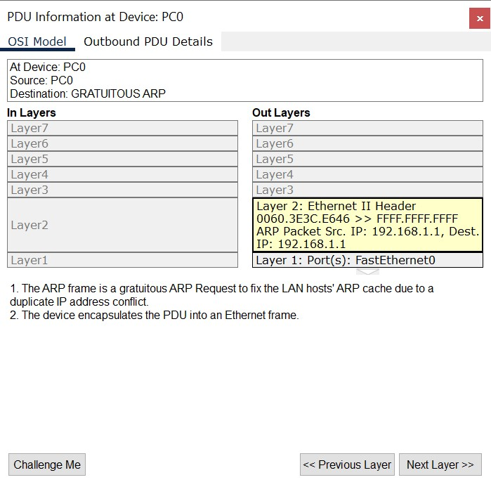
  
- Dikarenakan MAC dari IP Address destination tidak ditemukan maka proses enkapsulasi terjadi pada layer 2 belum terpenuhi sehingga PC0 mengirim broadcast yang berisi paket ARP yang disebarkan ke semua MAC.

  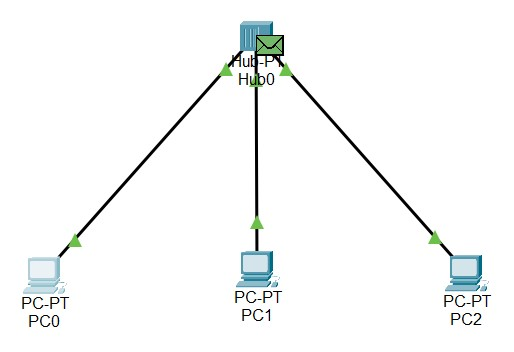
  
  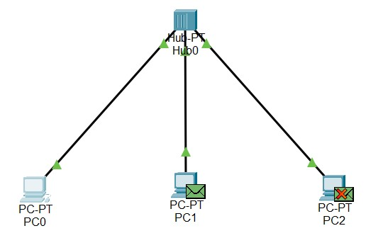
  
- Setelah disebarkan ke MAC, ternyata ada kesamaan pada MAC1.
- Setelah terdapat kesamaan, maka isi dari paket ARP diisikan oleh MAC IP destination yang akan dikembalikan pada MAC0.

  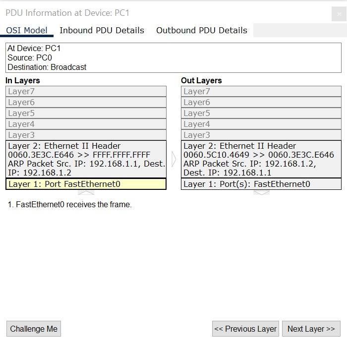
  
  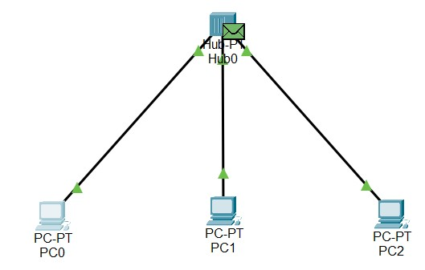
  
  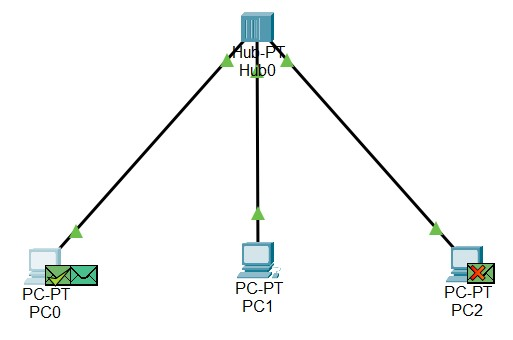
  
- Kemudian alamat yang sebelumnya FFFF.FFFF.FFFF akan tergantikan dengan alamat MAC1

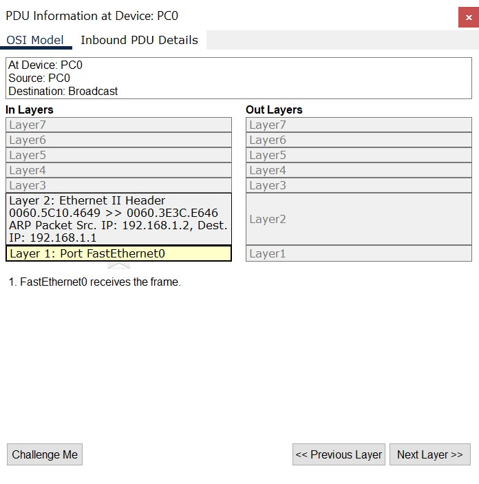

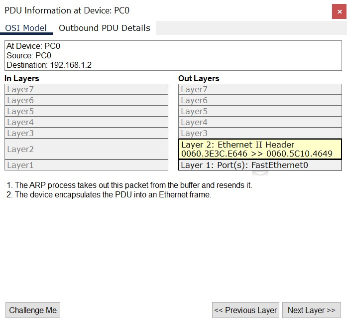

- Setelah melakukan ping, ketika dilakukan pengecekan ARP maka MAC1 akan tersimpan

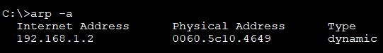

## Skenario 2, PC0 ke PC1

- Pertama cek ARP dan lakukan ping PC1 pada Command Prompt dari PC0

  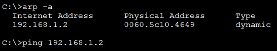
  
- Setelah dilakukan ping maka akan muncul pesan :

  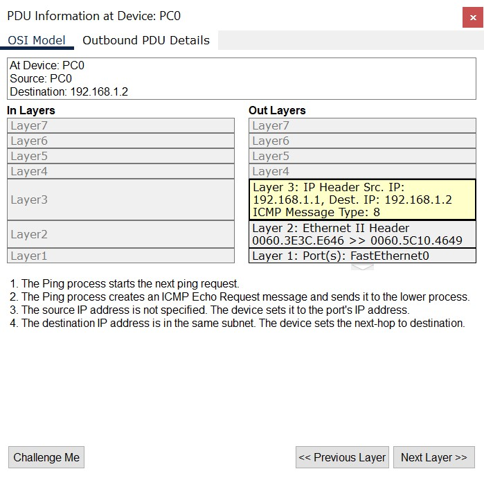
  
 - Sama seperti skenario 1, namun kali ini tidak melakukan broadcast lagi karena syarat enkapsulasi pada layer ke-2 sudah terpenuhi yaitu MAC IP address destination (tujuan).
 
  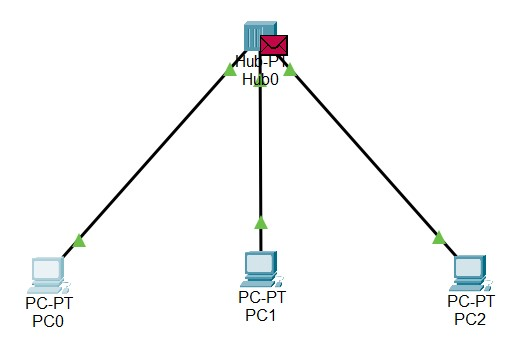

  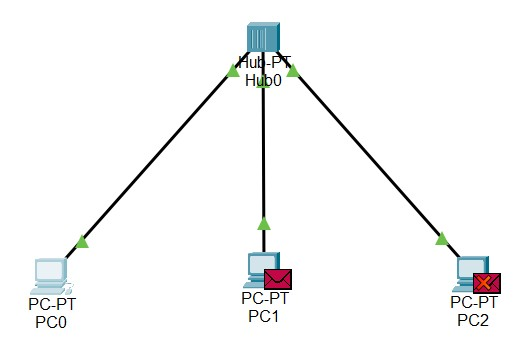
  
  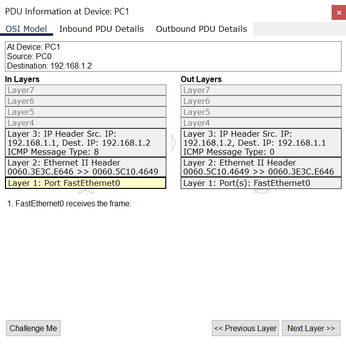
  
- Terdapat kesamaan dalam PC1 dengan MAC IP addres destination, kemudian dikembalikan ke alamat utama dan diterima pada PC0.

  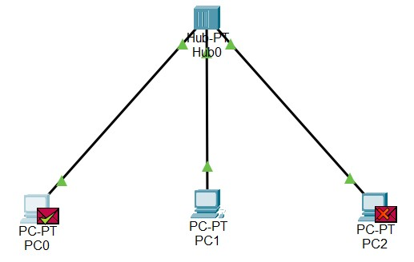
  
  

- Pertanyaan : Apakah dalam proses ping ini terjadi broadcast lagi ?
  Tidak, karena IP pada MAC1 sudah disimpan pada ARP MAC0

## Skenario 3, PC1 ke PC0

- Mula-mula cek ARP dan lakukan ping ke PC0 pada Command Prompt PC1

  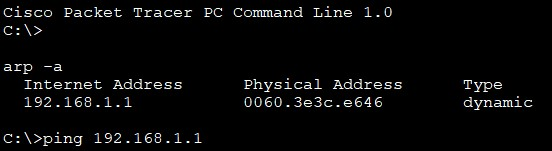
  
- Skenario 3 memiliki kesimpulan yang sama dengan skenario 2.

  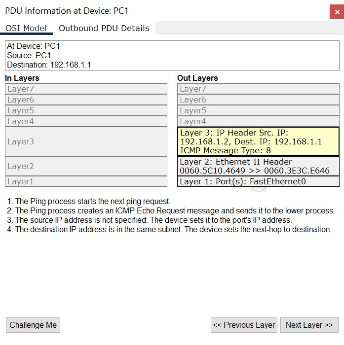
  
  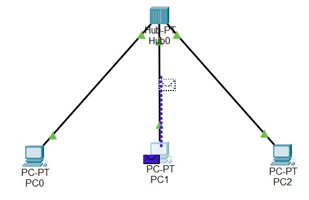
  
  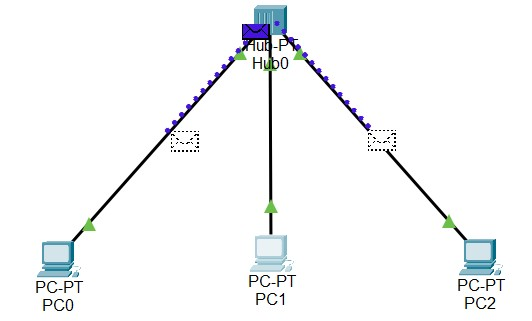
  
  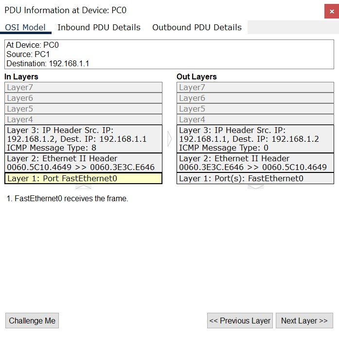
  
  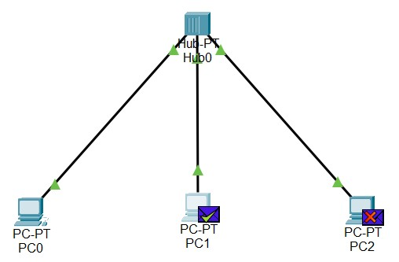
  
  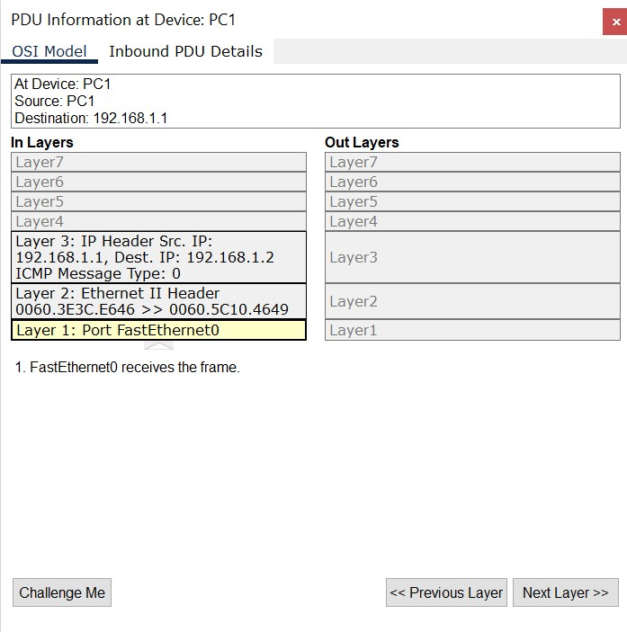

- Pertanyaan : Apakah dalam proses ping ini terjadi broadcast lagi?
  Tidak, karena IP pada MAC0 sudah disimpan pada ARP MAC1 pada saat awal melakukan broadcast.