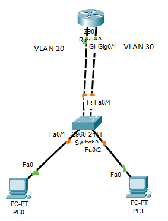

# Laporan Praktikum Konsep Jaringan

### Nama : Muhammad Faishal Nabhan

### NRP : 3121600021

### Kelas : 2 D4 Teknik Informatika A

# Praktikum 5 - VLAN

## A. Pengertian VLAN

VLAN adalah virtual local area network atau suatu model jaringan yang tidak terbatas pada lokasi fisik seperti LAN, hal ini mengakibatkan suatu network dapat dikonfigurasi secara virtual tanpa harus menuruti lokasi fisik peralatan. Penggunaan VLAN akan membuat pengaturan jaringan menjadi sangat fleksibel karena dapat dibuat segmen yang bergantung pada organisasi, tanpa bergantung lokasi workstations, eperti kita ketahui bahwa switch tidak bisa membaca Layer 3 sehingga tidak bisa membaca Network sehingga hanya bisa dihubungkan hanya satu network saja.

## Kegunaan VLAN

- Menimalisir kemungkinan terjadinya konflik IP yang terlalu banyak.
- Mencegah terjadinya collision domain (tabrakan domain).
- Mengurangi tingkat vulnerabilities.

## Jenis-jenis VLAN dalam Switch

1. VLAN default adalah VLAN yang sudah ada secara default contoh di cisco VLAN1,VLAN1002
2. Data VLAN adalah VLAN yang digunakann oleh user
3. VLAN VOIP adalah dikhususkan untuk komunikasi suara dan akan memberikan prioritas utama dibandingkan datanya
4. VLAN Native
5. VLAN management adalah VLAN yang dibangun keperluan management switch, misalnya : akan mengubah konfigurasi switch Admin, dan Admin dimasukkan ke VLAN management artinya hanya orang-orang yang keperluan khusus

## Cara kerja VLAN

Berikut adalah setail langkah demi langkah tentang cara kerja Virtual
Local Area Network :

1. Virtual Local Area Network dalam jaringan diidentifikasi dengannomor
2. Rentang yang valid adalah 1-4094. Pada saklar Virtual Local Area Network, anda menetapkan port dengan nomor Virtual Local Area
   Network yang tepat
3. Saklar kemudian memungkinkan data yang perlu dikirim antara berbagai port yang memiliki Virtual Local Area Network yang sama
4. Karena hampir semua jaringan lebih besar dari satu saklar, harus ada
   cara untuk mengirim lalu lintas antara dua saklar
5. Salah satu cara sederhana dan mudah untuk melakukannya adalah dengan
   menetapkan port pada setiap switch jaringan. Dengan Virtual Local
   Area Network dan menjalankan kabel antara keduanya.

## Praktikum

berikut merupakan topologi VLAN yang akan saya gunakan.

Konfigurasi IP yang akan digunakan sebagai berikut :

| Device  | Interface | IP Address      | Gateway      |
| ------- | --------- | --------------- | ------------ |
| Router0 | vlan10    | 172.17.10.1/24  |              |
|         | vlan20    | 172.17.30.1/24  |              |
| pc0     | fa0/1     | 172.17.10.21/24 | 172.17.10.24 |
| pc1     | fa0/3     | 172.17.30.23/24 | 172.17.30.24 |

vlan 10 akan melalui port gi0/0 pada router dan port fa0/3 pada switch, sedangkan vlan 30 akan melalui port gi0/1 pada router dan port fa0/4 pada switch

konfigursi pada switch supaya dapat terhubung dengan jaringan dari router ke pc tujuan. PC0 terhubung dengan switch pada port fa0/1 yang memiliki akses vlan 10 dan PC1 terhubung dengan switch pada port fa0/3 yang memiliki akses vlan 30

testing ping PC0 ke PC1

Footer
