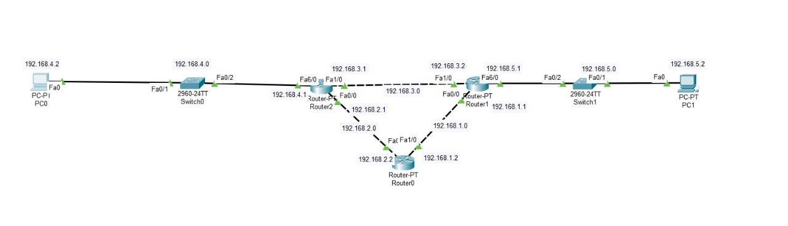
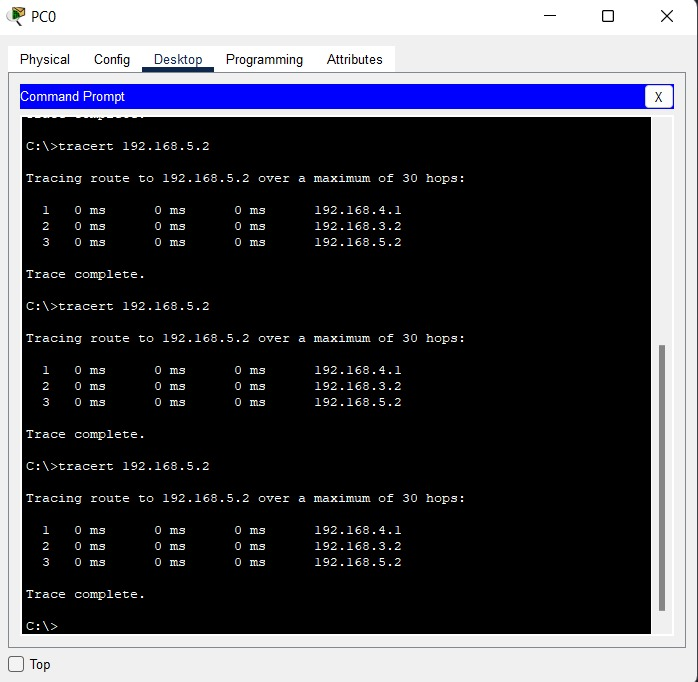
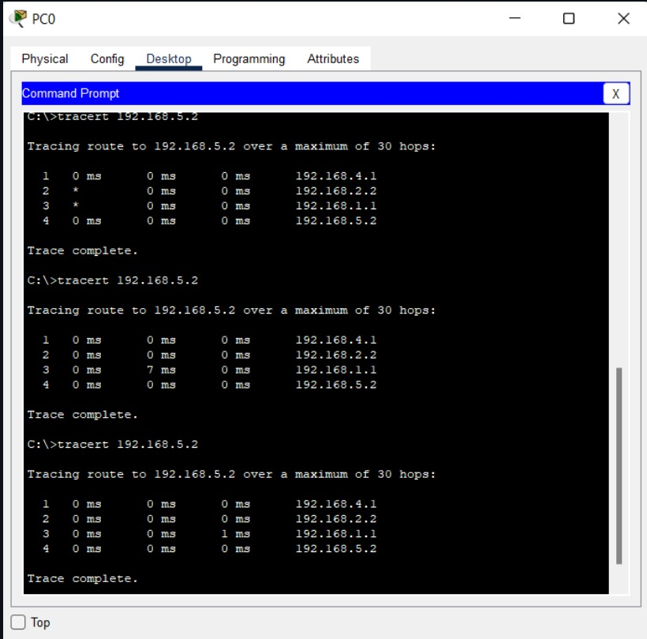
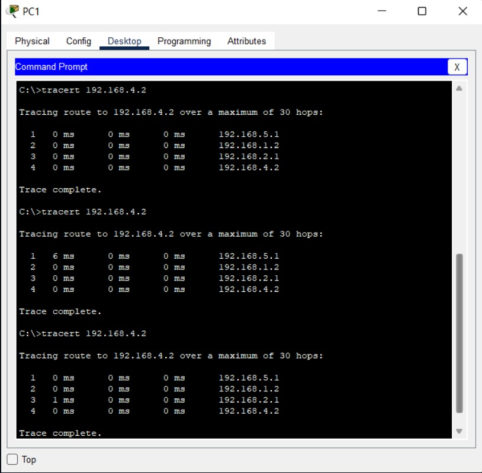

# Laporan Praktikum Konsep Jaringan

### Nama : Muhammad Faishal Nabhan

### NRP : 3121600021

### Kelas : 2 D4 Teknik Informatika A

# Praktikum 8 - Traceroute dan Time-To-Live

## Teori

### Traceroute

Traceroute adalah sebuah perintah yang mana bertujuan untuk menunjukkan rute yang dilewati oleh paket untuk menjapai tujuannya. Hal ini dilakukan dengan cara mengirim pesan ICMP Echo request ke tujuan dengan value TTL. Traceroute biasanya akan menampilkan 3 kolom terpisah untuk melakukan hop diakrenakan setiap traceroute akan mengirimkan 3 informasi terpisah pada setiap komputernya dan terdapat batas maksimum untuk melewati hop yaitu 30. ketika traceroute mengalami kegagalan untuk mengakses komputer maka akan menampilkan pesar RTO (Request Time Out) yang ditandakan dengan tanda bintang.
Traceroute berjalan dengan awalnya utilitas akan memulai pengirimakan paket menggunakan ICMP yang mana TTL juga termasuk. ICMP dan TLL akan mengembalikan pesan Time Exceed yang mana traceroute akan menentukan waktu yang diperlukan untuk ke hop router pertama dengan meningkatkan time limit serta mengirimkan ulang paket sehingga paket akan mencapai router kedua di jalur tujuannya.

### Time To Live

Time To Live adalah sebuah mekanisme yang membatasi usia pakai pada suatu paket dalam komputer/jaringan. Value TTL menentukan paket harus diterukan ke router selanjutnya atau tidak yang mana TTL ini memiliki nilai default 64 dengan maksimum 255 dan nilainya akan berkurang ketika melewati router atau hop. TTL dapat dilihat ketika kita melakukan ping pada jaringan.

## Praktikum

## TOPOLOGI

Terdiri dari 3 router, 2 MAC, dan 2 Switch.

### Konfigurasi IP Route

|Perangkat|Interface|IP          |
|---------|---------|------------|
|Router0  |Fa0/0    |192.168.2.2 |
|         |Fa1/0    |192.168.1.2 |
|Router1  |Fa0/0    |192.168.1.1 |
|         |Fa1/0    |192.168.3.2 |
|         |Fa2/0    |192.168.5.1 |
|Router2  |Fa0/0    |192.168.2.1 |
|         |Fa1/0    |192.168.3.1 |
|         |Fa2/0    |192.168.4.1 |

### Konfigurasi IP MAC

|Perangkat|Interface|IP          |
|---------|---------|------------|
|PC0      |Fa0/0    |192.168.4.2 |
|PC1      |Fa0/0    |192.168.5.2 |

### Konfigurasi Static Routing pada Komputer

|Perangkat|Destination Network |Netmask       |Via         |Metric|
|---------|--------------------|--------------|------------|------|
|Router0  |192.168.4.0         |255.255.255.0 |192.168.2.1 |10 (default) |
|         |192.168.5.0         |255.255.255.0 |192.168.1.1 |10 (default) |
|Router1  |192.168.4.0         |255.255.255.0 |192.168.3.1 |10 (default) |
|         |192.168.2.0         |255.255.255.0 |192.168.1.2 |10 (default) |
|Router2  |192.168.5.0         |255.255.255.0 |192.168.3.1 |10 (default) |
|         |192.168.1.0         |255.255.255.0 |192.168.2.2 |10 (default) |

Pada table diatas/konfigurasi static bisa dilakukan dengan cara memasukkan perintah pada CLI yang mana memiliki perintas sebagi berikut :

IP route [Destination Network][Netmask][Via][Metric]

## Percobaan

1. jika menggunakan windows : tracert {IP address}
2. jika menggunakan linux : traceroute {IP address}

Dapat dilihat pada gambar diatas bahwa PC0 (192.168.4.2) melakukan tracert ke PC1 (192.168.5.2) melalui router 2 (192.168.4.1) lalu router 1 (192.168.5.1) dan sampai pada PC1 berlaku juga pada sebaliknya

### Mengubah Metric pada Static Routing

|Perangkat|Destination Network |Netmask       |Via         |Metric|
|---------|--------------------|--------------|------------|------|
|Router0  |192.168.4.0         |255.255.255.0 |192.168.2.1 |10 (default) |
|         |192.168.5.0         |255.255.255.0 |192.168.1.1 |10 (default) |
|Router1  |192.168.4.0         |255.255.255.0 |192.168.3.1 |10 (default) |
|         |192.168.4.0         |255.255.255.0 |192.168.1.2 |5|
|Router2  |192.168.5.0         |255.255.255.0 |192.168.3.1 |10 (default) |
|         |192.168.5.0         |255.255.255.0 |192.168.2.2 |5|

Jalur yang efisien dapat diubah dengan cara merubah nilai metric pada konfigurasi karena semakin rendah nilai metric maka akan semakin di prioritaskan.

Dapat dilihat pada gambar diatas saat PC0 melakukan tracert ke PC1 yang mana setelah mengubah metric pada suatu router maka sekarang jalur yang dilalui paket adalah router2 lalu ke router0 lalu ke router1 dan sampai pada tujuan yaitu PC1 begitu juga pada saat PC1 melakukan tracert ke PC0 yang mana melalui router1 lalu ke router0 lalu ke router2 dan sampai pada tujuan yaitu PC0.

Dapat disimpulkan dari percobaan diatas adalah konfigurasi metric mempengaruhi jalur yang akan dilalui oleh paket. Dapat dilihat pada percobaan diatas bahwa jalur yang paling esifien melalui router2 lalu ke router1. Namun, ketika metric dengan router lain dikecilkan maka jalur yang dilalui adalah router2 lalu ke router0 lalu ke router1 hal ini terjadi dikarenakan semakin kecil metricnya maka akan semakin menjadi prioritas dimana metric 10 merupakan metric default.
Footer
